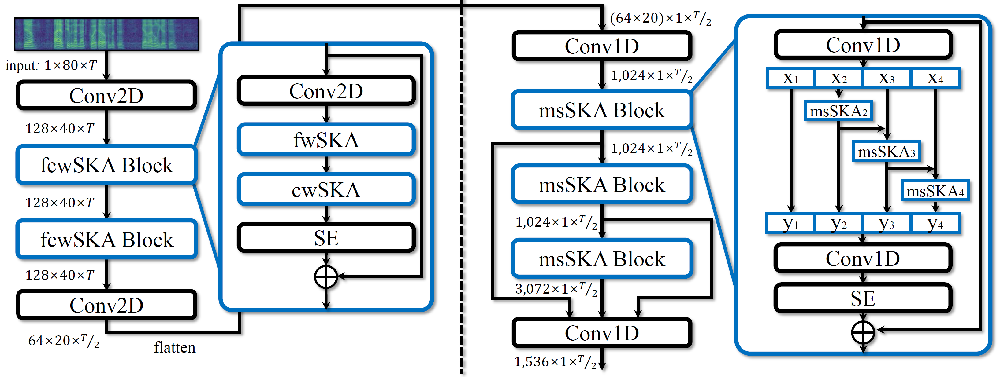

# SKA-TDNN


<br/><br/>

This repository is the implementation of the paper "[Frequency and Multi-Scale Selective Kernel Attention for Speaker Verification](https://arxiv.org/abs/2204.01005)," which is to be published in IEEE SLT 2022. The code is developed based on the [voxceleb_trainer](https://github.com/joonson/voxceleb_unsupervised).

## Dependencies
If you use the Anaconda virtual environment,
```
conda create -n ska-tdnn python=3.9 cudatoolkit=11.3
conda activate ska-tdnn
```
Install all dependency packages,
```
pip3 install -r requirements.txt
```


## Data Preparation
The [VoxCeleb](https://mm.kaist.ac.kr/datasets/voxceleb/) datasets are used for these experiments.
The train list should contain the file path and speaker identity for instance,
```
id00012/21Uxsk56VDQ/00001.wav id00012
id00012/21Uxsk56VDQ/00002.wav id00012
...
id09272/u7VNkYraCw0/00026.wav id09272
id09272/u7VNkYraCw0/00027.wav id09272
```
The example files of train list for VoxCeleb2 and the test lists for VoxCeleb1-O, VoxCeleb1-E, VoxCeleb1-H can be download from [train_vox2.txt](https://drive.google.com/file/d/1Y6yjKDULxJ40mhLzeKUzkeAvqNlP0tzX/view?usp=sharing) and [veri_test2.txt](https://drive.google.com/file/d/1EUDR5oCPC-zOexhLBHbFQpdnw1IRWq-B/view?usp=sharing), [list_test_all2](https://drive.google.com/file/d/1BgnEugORlSPsi4ZpTjTayAGPqyWTm7S8/view?usp=sharing), [list_test_hard2](https://drive.google.com/file/d/1p-gbPbDK4dy_SvSRWZ3KP17iZdHqjHQ4/view?usp=sharing), respectively. You can also follow the instructions on the [voxceleb_trainer](https://github.com/clovaai/voxceleb_trainer) repository for the download and data preparation of training, augmentation, and evaluation.


## Training
Distributed Data Parallel (DDP) training example: SKA_TDNN with a vanilla cosine similarity (COS) evaluation every epoch,
```
CUDA_VISIBLE_DEVICES=0,1,2,3 python trainSpeakerNet.py \
        --max_frames 200 \
        --eval_frames 0 \
        --num_eval 1 \
        --num_spk 100 \
        --num_utt 2 \
        --augment Ture \
        --optimizer adamW \
        --scheduler cosine_annealing_warmup_restarts \
        --lr_t0 25 \
        --lr_tmul 1.0 \
        --lr_max 1e-3 \
        --lr_min 1e-8 \
        --lr_wstep 10 \
        --lr_gamma 0.5 \
        --margin 0.2 \
        --scale 30 \
        --num_class 5994 \
        --save_path ./save/ska_tdnn \
        --train_list ./list/train_vox2.txt \
        --test_list ./list/veri_test2.txt \
        --train_path /path/to/dataset/VoxCeleb2/dev/wav \
        --test_path /path/to/dataset/VoxCeleb1/test/wav \
        --musan_path /path/to/dataset/MUSAN/musan_split \
        --rir_path /path/to/dataset/RIRS_NOISES/simulated_rirs \
        --model SKA_TDNN \
        --port 8000 \
        --distributed
```

## Evaluation
Evaluation example using vanilla cosine similarity (COS) on the VoxCeleb1-O,
```
CUDA_VISIBLE_DEVICES=0,1,2,3 python trainSpeakerNet.py \
        --eval \
        --eval_frames 0 \
        --num_eval 1 \
        --initial_model ./save/ska_tdnn/model/your_model.model \
        --test_list ./list/veri_test2.txt \
        --test_path /path/to/dataset/VoxCeleb1/test/wav \
        --model SKA_TDNN \
        --port 8001 \
        --distributed
```
Evaluation example using Test Time Augmentation (TTA) on the VoxCeleb1-E,
```
CUDA_VISIBLE_DEVICES=0,1,2,3 python trainSpeakerNet.py \
        --eval \
        --tta \
        --eval_frames 400 \
        --num_eval 10 \
        --initial_model ./save/ska_tdnn/model/your_model.model \
        --test_list ./list/list_test_all2 \
        --test_path /path/to/dataset/VoxCeleb1/all/wav \
        --model SKA_TDNN \
        --port 8002 \
        --distributed
```
Evaluation example using Score Normalisation (SN) on the VoxCeleb1-H,
```
CUDA_VISIBLE_DEVICES=0,1,2,3 python trainSpeakerNet.py \
        --eval \
        --score_norm \
        --type_coh utt \
        --top_coh_size 20000 \
        --eval_frames 0 \
        --num_eval 1 \
        --initial_model ./save/ska_tdnn/model/your_model.model \
        --train_list ./list/train_vox2.txt \
        --test_list ./list/list_test_hard2 \
        --train_path /path/to/dataset/VoxCeleb2/dev/wav \
        --test_path /path/to/dataset/VoxCeleb1/all/wav \
        --model SKA_TDNN \
        --port 8003 \
        --distributed
```


## Citation
If you utilize this repository, please cite the following paper,
```
@article{mun2022frequency,
  title={Frequency and Multi-Scale Selective Kernel Attention for Speaker Verification},
  author={Mun, Sung Hwan and Jung, Jee-weon and Han, Min Hyun and Kim, Nam Soo},
  journal={arXiv preprint arXiv:2204.01005},
  year={2022}
}
```